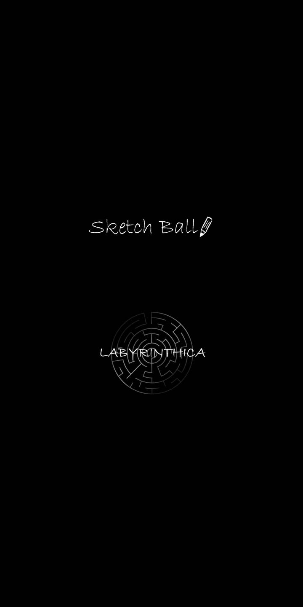
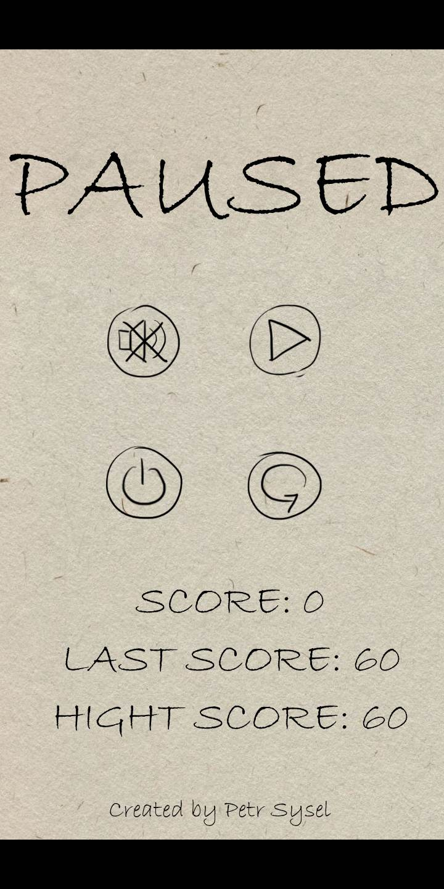
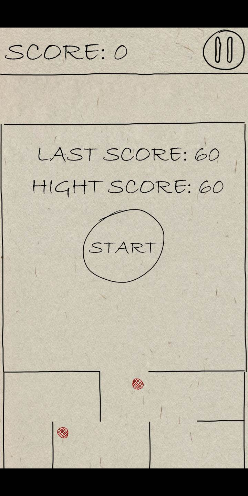
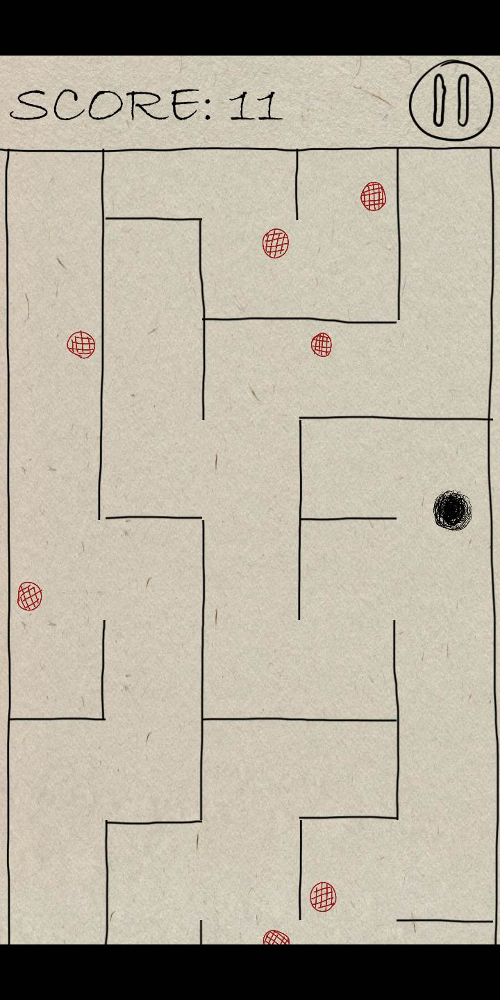
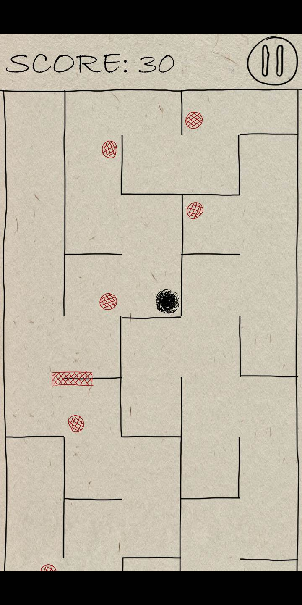
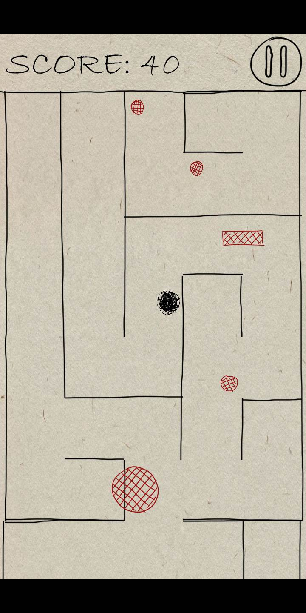
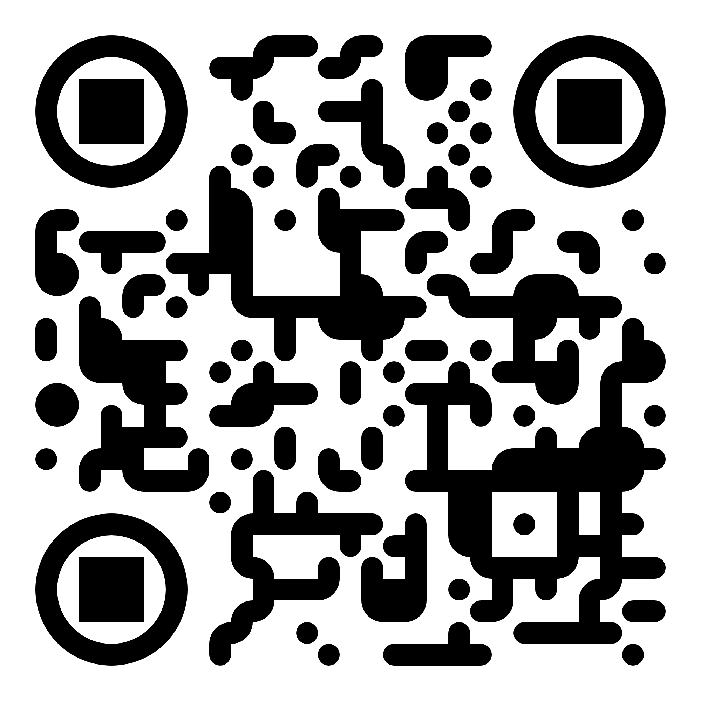
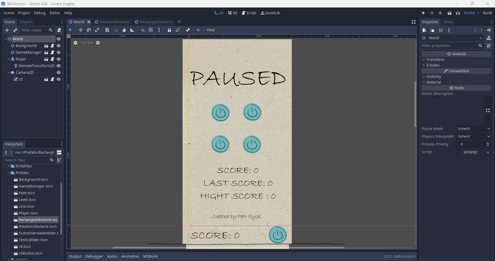
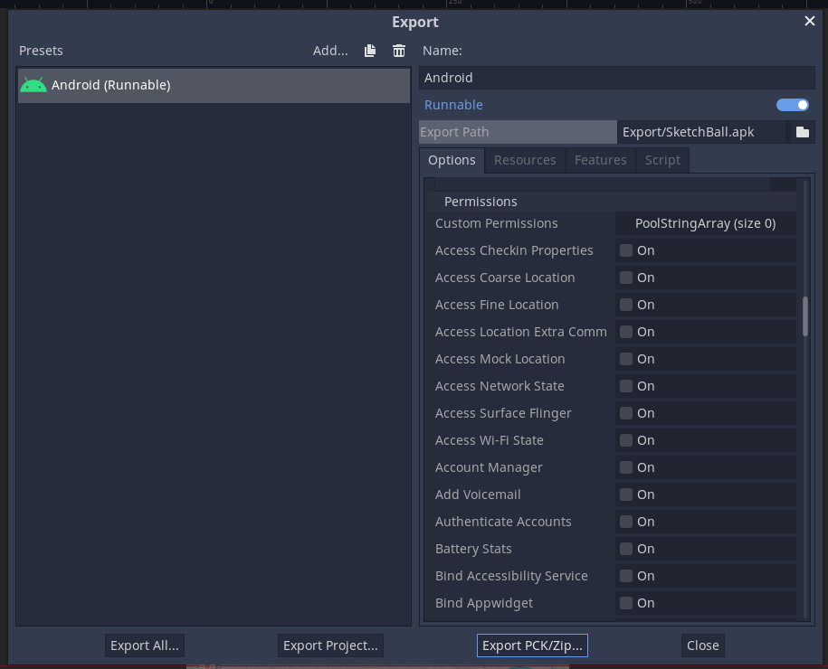
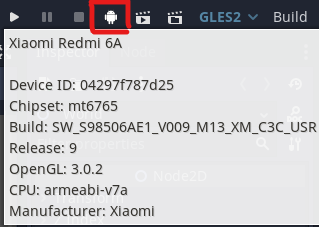

# Sketch Ball

## Popis

Sketch Ball je mobilní hra pro operační systém Android, vytvořená za použití herního enginu Godot a programovacího jazyka C#. <br>
Cílem hry je získání co největšího score tím, že se hráč snaží, pomocí naklánění mobilu, dostat kuličku náhodně generovaným bludištěm co nejdál. Zároveň se musí vyhýbat statickým i pohyblivým překážkám. Narazí-li do překážky, hra končí.

## Screenshoty ze hry

<div style="display:flex; flex-wrap:wrap">












</div>

## Ke stažení
APK soubor hry si můžete stáhnout [zde](./Export/SketchBall.apk).<br>
Hra je také dostupná na [Google Play](https://play.google.com/store/apps/details?id=org.godotengine.sketchball):<br>


## Použité nástroje
- [Godot](https://godotengine.org) (v3.5 mono)
- [Visual Studio Code](https://code.visualstudio.com)
- [Krita](https://krita.org)

## Řešení projektu
Ukázka editoru v enginu Godot:


### Přístup k senzorům zařízení
Knihovna Godot pro C# obsahuje mnoho nástrojů pro práci s operačním systémem Android, včetně přístupu k senzorům. Ukázka přístupu ke gravitačnímu senzoru a implementace pohybu kuličky:

```cs
Vector3 gravity = Input.GetGravity()*1f;
Acceleration = new Vector2(gravity.x, -gravity.y);
Velocity += player.Acceleration;        
Velocity = player.MoveAndSlide(player.Velocity);
```
Objekt Input obsahuje také například funkci GetAcceleromater(), která funguje obdobně. Pro přístup k těmto senzorům není nutné žádné zvláštní povolení uživatelem. Pokud by aplikace nějaké speciální povolení požadovala, vybere se v nastavení exportu aplikace.


### Debugování programu
Pro debugování aplikací pro mobilní zařízení  obsahuje Godot nástroj, který automaticky rozpozná zařízení připojené k počítači, nainstaluje aplikaci a spustí ji.

<br>
Také lze využít nástroj Remote Debuger pro debugování bezdrátově.

### Generování bludiště
Pro generování bludiště je použit algoritmus [Randomized depth-first search](https://en.wikipedia.org/wiki/Maze_generation_algorithm#Randomized_depth-first_search) vycházející z algoritumu [Prohledávání do hloubky](https://cs.wikipedia.org/wiki/Prohledávání_do_hloubky) (depth-first search) pro procházení grafů.
<br>Popis iterativní verze algoritmu:
```
1. Vyber výchozí buňku, označ ji jako navštívenou a přidej ji do zásobníku
2. Dokud není zásobník prázdný
    1. Vyndej buňku ze zásobníku a označ ji jako aktuální
    2. Pokud má aktuální buňka nějaké nenavštívené sousední buňky
        1. Přidej aktuální buňku do zásobníku
        2. Vyber jednu z nenavštívených sousedních buněk
        3. Odstraň zeď mezi vybranou sousední buňkou a aktuální buňkou
        4. Označ vybranou sousední buňku jako navštívenou
```

### Stavový automat řízení hry
Hra je řízena stavovým audomatem hráče, který říká, v jakém stavu se hráč zrovna nachází. Každý stav má naimplementované vlastní chování. Zjednodušená ukázka implementace stavového automatu:

```cs
// Model stavu hráče
public interface IPlayerState{
    Player Player{
        get;
        set;
    }

    void Update(float delta);
    void OnStateChanged();
}

// Implementace stavu hráče
public class PlayerStateGame{
    Player Player{
        get;
        set;
    }
    public PlayerStateGame(Player player){
        Player = player
    }
    public void OnStateChanged(){
        // Co má být provedeno po změně stavu na tento
    }
    public void Update(float delta){
        // Implementace chování hráče v tomto stavu
    }
}

public class Player{
    // Stav ve kterém se hráč nachází
    public IPlayerState State{
        get;
        set;
    }
    

    public void _Ready(){
        ChangeState(new PlayerStateGame(this)); // Vytvoření nového stavu hry a změna stavu hráče na tento stav
    }
    public override void _Process(float delta)
    {
        State.Update(delta); // Volání metody Update aktuálního stavu
    }

    public void ChangeState(IPlayerState state){
        State = state;  // Změna stavu
        State.OnStateChanged(); // Volání akcí při změně stavu
    }
}
```
Kompletní implementaci naleznete [zde](./Scripts/Player.cs).

### Ukládání hry
Ukládání hry má Godot opět řešené velice jednoduše:
```cs
public class SaveManager{
    Player player;
    public SaveManager(Player player){
        this.player = player;
    }

    // Implementace ukládání hry
    public void SaveGame(){
        File saveGame = new File(); // Vytvoření objektu souboru
        saveGame.Open("user://sketchBall.save", File.ModeFlags.Write);  //  Otevření souboru pro zápis

        // Vytvoření Dictionary data pro uložení
        Godot.Collections.Dictionary<string, object> data = new Godot.Collections.Dictionary<string, object>(){
            {"lastScore", player.ScoreManager.LastScore},
            {"hightScore", player.ScoreManager.HightScore},
            {"mute", player.GameManager.AudioManager.IsMute}
        };
        // Vytvoření JSONu z Disctionary a jeho uložení do souboru
        saveGame.StoreLine(JSON.Print(data));
        // Uzavření souboru
        saveGame.Close();
    }

    // Implementace Načítání hry
    public void LoadGame(){
        var saveGame = new File();  // Vytvoření objektu souboru
        //  Ověření existence souboru
        if (!saveGame.FileExists("user://sketchBall.save")) return;
        //  Otevření souboru pro čtení
        saveGame.Open("user://sketchBall.save", File.ModeFlags.Read);

        // Čtení řádek souboru
        while (saveGame.GetPosition() < saveGame.GetLen())
        {
            // Přečtení stringu ze souboru, převedení do JSON formátu a vytvoření Dicrionary s těmito daty
            var nodeData = new Godot.Collections.Dictionary<string, object>((Godot.Collections.Dictionary)JSON.Parse(saveGame.GetLine()).Result);

            //  Načtení dat do hry
            player.ScoreManager.LastScore = int.Parse(nodeData["lastScore"].ToString());
            player.ScoreManager.HightScore = int.Parse(nodeData["hightScore"].ToString());
            player.GameManager.AudioManager.IsMute = bool.Parse(nodeData["mute"].ToString())
        }
        // Uzavření souboru
        saveGame.Close();
    }
}
```
Cesta user:// je umístěna ve složce, kde je hra nainstalována, nezávisle na operačním systému.

### Nedostatky

Projekt má několik nedostatků. Největší z nich je nevhodně navržené řízení hry. Jak se projekt vyvíjel, převzal celé řízení hry objekt Player, takže nyní obsahuje také například stav Menu, kterým se řídí GameManager a uživatelské rozraní. Obzvlášť u GameManageru by to tak být nemělo. Tento nedostatek ztěžuje rozšiřování hry a přehlednost kódu. Kdybychom chtěli projekt řešit lépe, vytvořili bychom stavový automat i pro GameManager. Ten by pod sebou měl všechny prvky hry a mohl by tak lépe koordinovat chod hry.<br>
Projekt by šlo také lépe rozdělit do více znovupoužitelných částí, ze kterým by se hra ve finále složila. To by umožnilo lepší rozšířitelnost hry.

## Assety
### Grafika
Grafika je z velké části vlastní, vytvořená v grafickém editoru Krita. Jediná převzatá část ([odtud](https://unsplash.com/s/photos/paper-texture)) je textura papíru, použitá na pozadí hry.

### Zvuk
Zvuky hry jsou převzaté z [tohoto](https://opengameart.org/content/various-paper-sound-effects) webu, odkud jsou dostupné i jiné než zvukové herní assety.

## Autor
Petr Sysel